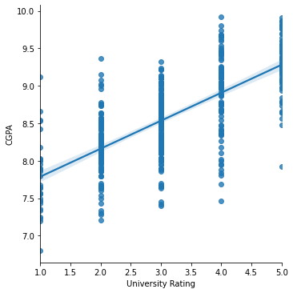
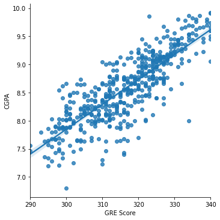

### 
Data Analysis Practice

## 1. Data Analysis Pathway

- **Scrape data from websites:** Show your code, and use hashed comments to explain your thinking.
- **Clean data:** Take a dataset with missing, duplicate, or other problematic data, and walk through your data cleaning process.
- **Perform different types of analysis:** Use data to perform diagnostic, descriptive, predictive, and prescriptive analysis.
- **Visualize data to tell a story:** Create a chart, map, graph, or other visualization to make your data easier to understand.
- **Communicate complex ideas:** Consider writing a blog post that outlines your process or explains a difficult data concept to highlight your communication skills.
- **Collaborate with others:** If you’ve worked on a group project, be sure to include it.
- **Use data analysis tools:** Share projects that show off your ability to use SQL, Python, R, Tableau, etc.

## 2. How to perform Exploratory Data Analysis (EDA) (Basic Steps):

After looking at the data for the first time, you should ask yourself a few questions:

1. Do I need all of the variables?
2. Should I transform any variables?
3. Are there NA values, outliers or other strange values?
4. Should I create new variables?

**Steps To Follow -** 

1. Import Dependencies and the dataset.
2. Dropping unwanted columns or rows.
3. Rename Columns for readability.
4. Check for Missing Values ( pd.DataFrame.isna() ) or use isnull().sum(). If any use dropna().
To replace or Fill null values, use fillna(). - mean ffill, bfill, quantile, mode, median
5. Check the datatypes (Required if you want to convert from string to int or vice versa). (date)
6. Check for duplicate rows ( pd.DataFrame[ pd.DataFrame.duplicated() ] ). If there are any, use pd.DataFrame.drop_duplicates().
7. Identifying Outliers ( any values which are distant from all the values ).
8. Two methods- 1) Univariate 2) Multivariate
9. BoxPlots gives us more intuitive way to identify outliers. It depicts the distribution of data.
    
Incase of multivariate if the independent variable is categorical then we can use Boxplot.

Else Scatterplots are best for multivariate analysis.

### **IQR**

It tells you where majority of the data lie. Gives the central tendancy of the data.

Basically, quartiles are 3 points which divide the dataset in 4 parts.

3 points are Q1, Q2, Q3

Q1 - from smallest number in dataset to the median.

Q2 - median (This is where most of the data should lie ig).

Q3 - from median to the highest value in the dataset.

Q1 = np.percentile(df, 25)

Q3 = np.percentile(df, 75)

Alternatively, you can use df.describe() you can get 25%, 50% and 75% value.

IQR = Q3 - Q1

upper_limit = Q3 + 1.5*IQR

lower_limit = Q1 - 1.5*IQR

Exclude any value below lower_limit and exclude any value above upper_limit

- Linear Relationships between model is best fitted when the regression line passes through most of the data.
- The data should be linear.

For ex - This below is non linear because we cant draw a line between most of the data.

But for the below, it shows a linear relationship between CGPA and GRE Score

So lmplots or regplots are significant for drawing a linear relationship between 2 variables

To cross verify you can use correlation matrix to check the relationship between different variables in the dataset.

Coeff Corr should be near to +1 to depict positive corr between variables.